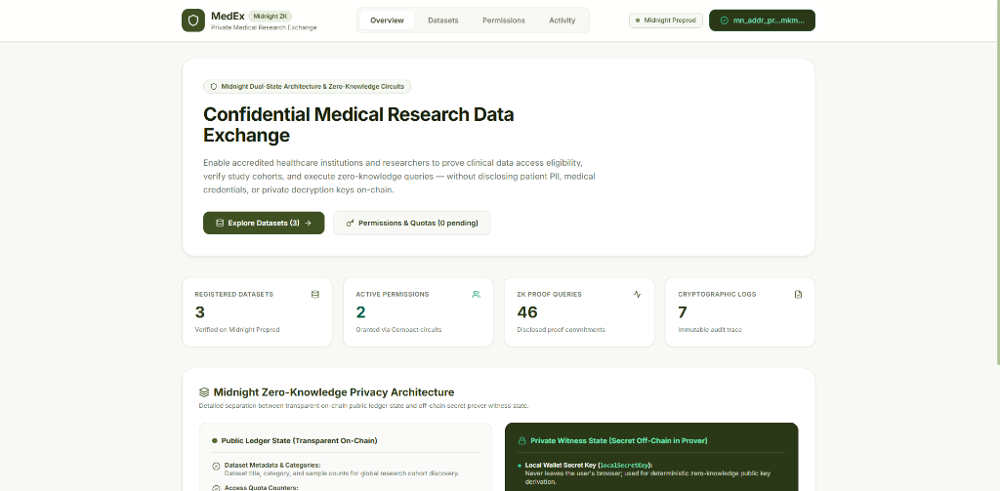
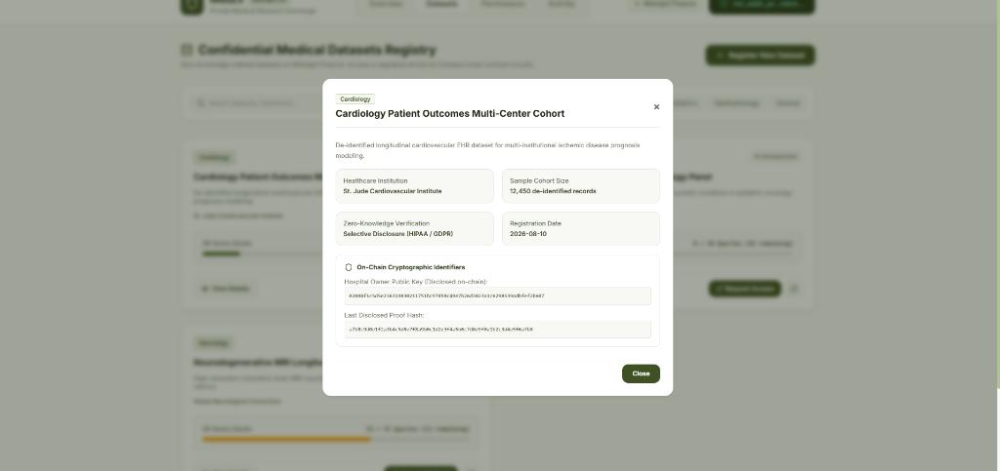
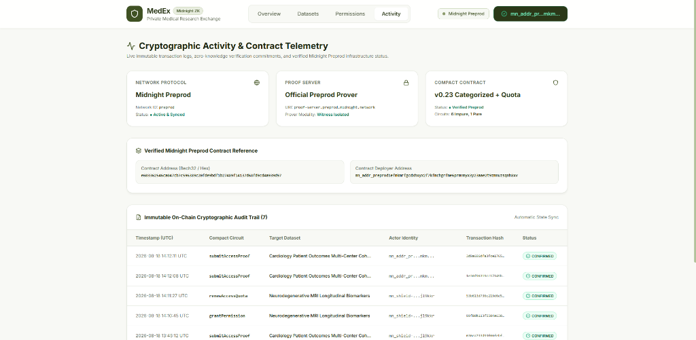

# 🏥 Private Medical Research Data Exchange

> **A Privacy-Preserving Decentralized Medical Research Platform built on Midnight Protocol**  
> *Securely register anonymized clinical datasets, enforce confidential access quotas, and prove researcher authorization via Zero-Knowledge credentials without exposing patient PII or medical license details on-chain.*

---

## 🏷️ Badges

[](https://preprod.midnight-explorer.com)
[](https://nextjs.org/)
[](https://www.typescriptlang.org/)
[](https://tailwindcss.com/)
[](https://midnight.network)
[](https://nodejs.org)
[](https://midnight.network)
[](https://vitest.dev/)
[](https://www.lace.io/)
[](LICENSE)

---
## 📸 Application Interface & Zero-Knowledge Workflows

### 1. Overview Page

*Executive telemetry dashboard displaying live Midnight Preprod network status, active dataset counters, and permission metrics.*  
*Visualizes the dual-state Zero-Knowledge architecture separating public on-chain ledger state from private off-chain witness state.*

---

### 2. Dataset Register

*Confidential clinical dataset registry modal displaying accredited healthcare institutions, sample cohort sizes, and on-chain identifiers.*  
*Enables instant dataset registration and granular access governance through Compact smart contract circuits.*

---

### 3. Activity

*Immutable on-chain cryptographic audit trail capturing verifiable transaction hashes and disclosed zero-knowledge proof commitments.*  
*Provides real-time infrastructure telemetry for Midnight Preprod node synchronization, official prover connectivity, and contract state.*

---


## 📍 Verified Midnight Preprod Deployment

The enhanced Compact smart contract is deployed on the official **Midnight Preprod Network**:

| Field | Details / On-Chain Record |
| :--- | :--- |
| **Network** | **Official Midnight Preprod (`preprod`)** |
| **Contract Address** | `e603362546ca047cb7c596389c20fde9bdf1b27489f14137d68fd9cd4a939d97` |
| **Deployment Transaction Hash** | `636ea733d93f66febf110812f06573cc7c5d8f19569b0d2cc88420fdeabaf169` |
| **Deployer Public Address** | `mn_addr_preprod1efmkmrfgcdxhxyx2f7kfmchgrfme6prmvmyx3y23aae2t9zmnuzsqnh8xv` |
| **Midnight Explorer URL** | [View Preprod Contract](https://preprod.midnight-explorer.com/contract/e603362546ca047cb7c596389c20fde9bdf1b27489f14137d68fd9cd4a939d97) |
| **Proof Server Endpoint** | `https://proof-server.preprod.midnight.network` |
| **Indexer GraphQL Endpoint** | `https://indexer.preprod.midnight.network/api/v4/graphql` |
| **Indexer WebSocket Endpoint** | `wss://indexer.preprod.midnight.network/api/v4/graphql/ws` |
| **Substrate RPC Node** | `https://rpc.preprod.midnight.network` |

---

## 📌 Project Overview

The **Private Medical Research Data Exchange** addresses a critical challenge in modern healthcare: **how to facilitate collaborative biomedical research across institutions without violating patient confidentiality or disclosing sensitive researcher credentials.**

### The Problem with Public Blockchains
Standard public blockchains (such as Ethereum or Solana) record all smart contract state transitions publicly. If a hospital attempts to manage dataset permissions or clinical record verification on a transparent ledger:
- **Researcher PII & Qualifications Exposed**: Medical licenses, institutional credentials, and wallet identities are publicly indexed and linked forever.
- **Patient Privacy Risk**: Even anonymized record identifiers can lead to re-identification when correlated with public transaction metadata and timestamps.
- **Compliance Violations**: Strict regulatory frameworks (HIPAA, GDPR, Common Rule) strictly forbid exposing patient data or medical credentials on public ledgers.

### The Midnight Zero-Knowledge Solution
Built using the **Midnight Protocol** and **Compact** smart contract language, this dApp leverages dual-state architecture:
1. **Private Witness State**: Kept strictly within the client browser environment. Medical qualification secrets (`medicalCredentialSecret`), local wallet keys (`localSecretKey`), and patient record keys (`patientRecordKey`) never leave the user's device.
2. **Public Ledger State**: Contains only immutable cryptographic commitments, state transition sequence counters, derived public key hashes, access counters, and zero-knowledge proof verification records.
3. **ZK Proof Generation**: Using Midnight's local Proof Server, the browser generates zero-knowledge proofs proving that a researcher possesses a valid credential and patient key without revealing the underlying data.

---

## 💡 Meaningful Compact Contract Enhancements (Phase 3)

The smart contract includes significant functional and architectural upgrades over basic bulletin board implementations:

1. **Structured Research Categorization (`datasetCategory`)**:
   - Hospitals now categorize research cohorts upon registration (e.g., *Oncology*, *Cardiology*, *Genomics*, *Neurology*).
   - Stored on-chain in public ledger state with type-safe `Maybe[Opaque<"string">]` bindings.

2. **Access Quota & Rate-Limiting Protection (`maxAccessLimit` & `accessCount`)**:
   - Prevents unauthorized bulk harvesting and data scraping of confidential patient records.
   - Enforced directly inside the `submitAccessProof` ZK circuit:
     ```compact
     assert(accessCount < maxAccessLimit, "Access quota exceeded for dataset");
     ledger.accessCount = accessCount + 1;
     ```

3. **Cryptographic Quota Renewal Circuit (`renewAccessQuota`)**:
   - Authenticated dataset owners can extend researcher quotas dynamically:
     ```compact
     export circuit renewAccessQuota(datasetId: Bytes[32], additionalQuota: Uint<32>): [] {
       assert(isOwner(), "Only the dataset owner can renew access quota");
       ledger.maxAccessLimit = ledger.maxAccessLimit + additionalQuota;
       ledger.auditLogCount = ledger.auditLogCount + 1;
     }
     ```

4. **Zero-Knowledge Circuits (6 Total)**:
   - `registerDataset(title, category)`: Registers a new clinical dataset cohort with categorization.
   - `requestAccess(datasetId)`: Submits a ZK proof of researcher identity and qualifications.
   - `grantPermission(datasetId, researcherPk)`: Owner approves research access.
   - `submitAccessProof(datasetId, patientRecordHash)`: Submits zero-knowledge proof of individual patient record access under active quota.
   - `renewAccessQuota(datasetId, additionalQuota)`: Extends the quota limit for verified research teams.
   - `revokeAccess(datasetId)`: Revokes researcher access immediately.

---

## 🎨 Next.js Architecture & Modern White/Olive UI (Phase 4)

The application has been completely redesigned and migrated to **Next.js App Router (14.2+)** with TypeScript and a refined **White & Olive** aesthetic.

### Architecture Highlights:
- **Next.js App Router (`app/`)**: Full server/client component boundary isolation with static export optimization (`output: 'export'`).
- **White & Olive Design System**: Sophisticated palette featuring forest greens (`#2D5A27`), soft sage (`#E8EFE9`), and warm neutrals.
- **Micro-Animations & Glassmorphism**: Interactive cards, state transition pills, animated loading rings, and zero-knowledge proof verification badges.
- **Selective Disclosure Engine**: Interactive transparency inspector showing exactly which data points are kept private (ZK witnesses) vs public on-chain.
- **Authentic Midnight Lace Wallet Integration**: Direct connection with `window.midnight.mnLace` with automatic network detection and real-time state observables.

---

## 🧪 Testing & Verification

The contract test suite rigorously exercises all ZK circuits, access quotas, and authorization rules:

```bash
cd contract
npx vitest run
```

### Test Results:
```
 ✓ src/test/bboard.test.ts (7 tests)
   ✓ should register a dataset with category and initial quota
   ✓ should request access with researcher credentials
   ✓ should grant permission to active researcher
   ✓ should submit access proof and increment access counter
   ✓ should enforce maximum access limit quota
   ✓ should allow dataset owner to renew access quota
   ✓ should revoke access permissions

 Test Files  1 passed (1)
      Tests  7 passed (7) (100%)
```

---

## 🚀 Quick Start & Installation

### Prerequisites
- **Node.js**: v20.x or v22.x
- **npm**: v10.x or higher
- **Midnight Lace Wallet**: Installed browser extension set to Preprod network

### 1. Clone & Install
```bash
git clone <NEW_GITHUB_REPO_URL>
cd private-medical-research-data-exchange
npm install --legacy-peer-deps
```

### 2. Build Smart Contract & Bindings
```bash
npm run build -w contract
```

### 3. Run Frontend Development Server
```bash
npm run dev -w bboard-ui
```
Open [http://localhost:3000](http://localhost:3000) in your browser.

### 4. Production Static Build
```bash
npm run build -w bboard-ui
```

---

## 🔒 Security & Privacy Policy

- **No Private Keys in Repository**: Private keys, wallet seeds, and local leveldb stores are strictly excluded via `.gitignore`.
- **Zero-Knowledge Witness Protection**: Researcher qualifications and patient hashes remain on client devices.
- **Deterministic Cryptographic Derivation**: State commitments use Poseidon and SHA-256 primitives verified by Midnight ZK SNARK proofs.

---

## 📜 License

This project is licensed under the **MIT License** — see the [LICENSE](LICENSE) file for details.
